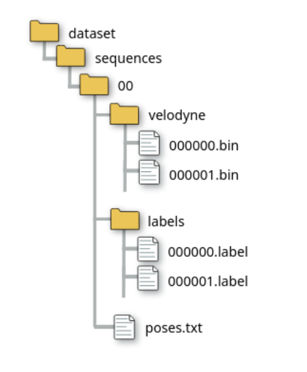

# KNN
* **Link to the dataset:** [data_odometry_velodyne.zip](https://s3.eu-central-1.amazonaws.com/avg-kitti/data_odometry_velodyne.zip)
* **Link to SemanticKITTI labels:** [data_odometry_labels.zip](https://semantic-kitti.org/assets/data_odometry_labels.zip)

Unpack labels into the dataset, so the structure will be like the following:

# How to use:
Call preprocess_data("path to the dataset")

Then use KittiDataset() as usual
